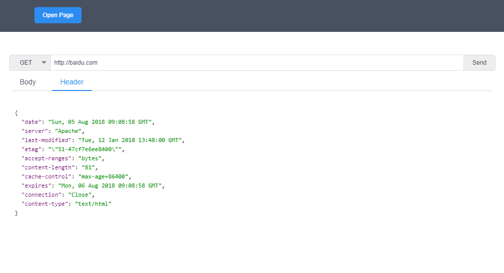

# Restful Tool
> Restful Tool 是一个基于 electron 的桌面应用程序，是一个简单的 HTTP restful API 请求工具。



#### Build Setup
``` bash
# install dependencies
npm install

# serve with hot reload at localhost:9080
npm run dev

# build electron application for production
npm run build
```

#### 版本说明
> 0.0.1 Alpha   
> 基本功能完成，可以发送 GET，POST，PUT，DELETE，HEAD，OPTION 请求，并且可以语法高亮显示。   
> 目前缺陷  
> * body 显示部分目前只是显示html高亮，没有根据 json 和 html 区分，后期会加上。
> * body 显示部分，json 暂时没有做格式化处理，后期会加上。
> * 请求结果主体部分暂时没有家样式大小限制，后期会加上。
